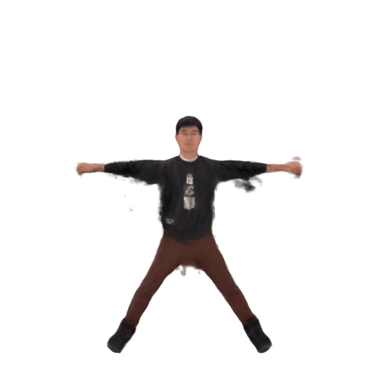
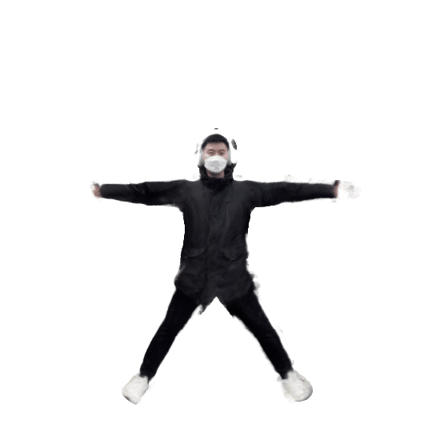
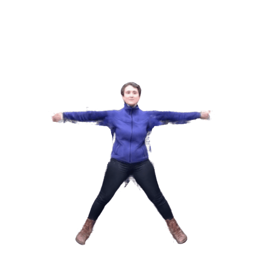
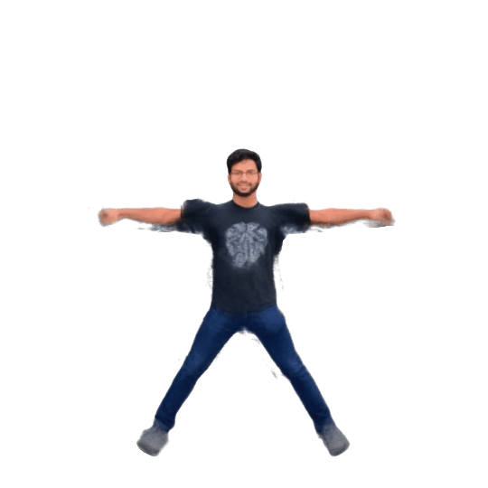
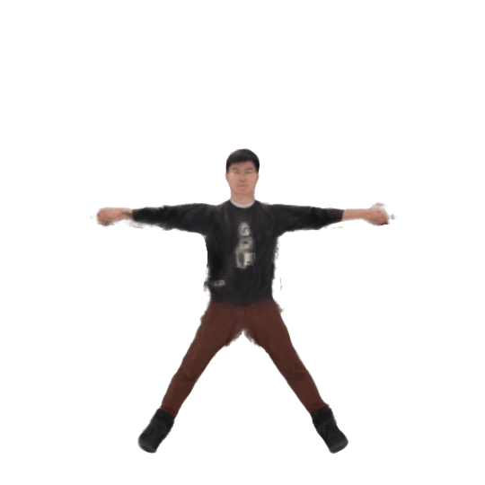

# Human-Avatar
## Introduction
This is a developing project about the paper : < Effieient Neural Implicit Representation for 3D Human Motion Reconstruction > \
We combine the HuMoR and InstantAvatar to get a higher performance in human neural renderding
## Superiority
There you can see some of our model's adventage: 

from left to right is OriginalVideo,ROMP,Ours(HuMoR)


And the rendered result:(Ours(left),InstantAvatar(right))
<p float="left"> 


</p>

## How to use 
NOTE: the use process is similar to instant-avatar,we modified the SMPL model from ROMP to HuMoR. \
So you should install both instant-avatar and HuMoR \
HuMoR: [HuMoR's repo](https://github.com/davrempe/humor) \
instant-avatar: [Avatar's repo](https://github.com/tijiang13/InstantAvatar)

## Install 
Follow upper repo and their installation guidance.

## Quick Start
Quickly learn and animate an avatar with `bash ./bash/run-demo.sh` \
Please make sure you get all the files in both repo. \


## Play with Your Own Video
Here we use the in the wild video provided by [Neuman](https://github.com/apple/ml-neuman) as an example:

1. create a yaml file specifying the details about the sequence in `./confs/dataset/`. In this example it's provided in `./confs/dataset/neuman/seattle.yaml`.
2. download the data from [Neuman's Repo](https://github.com/apple/ml-neuman), and run `cp <path-to-neuman-dataset>/seattle/images ./data/custom/seattle/`
3. run the bash script `bash scripts/custom/process-sequence.sh ./data/custom/seattle neutral` to preprocess the images, which
    - uses [Openpose](https://github.com/CMU-Perceptual-Computing-Lab/openpose) to estimate the 2D keypoints,
    - uses [Segment-Anything](https://github.com/facebookresearch/segment-anything) to segment the scene
    - uses [ROMP](https://github.com/Arthur151/ROMP) to estimate camera and smpl parameters
4. run the bash script `bash ./bash/run-neuman-demo.sh` to learn an avatar

After this you get the instant-avatar result.
To use HuMoR result,you need the extra process:
1. run the HuMoR to process yout own video.
2. run the script in `data/` , use `convert_humor_data2avatar.py` to process the frames like `python convert_humor_data2avatar.py input_directory output_directory
`
3. run the script in `data/` , use `combine_smpl_file.py` to process the SMPL result like`python script.py --rate 1 PATHTO/humor_results.npz PATHTO/romp_poses.npz poses.npz
`. 
4. (Optional)If you want to use less frames to train the avatar,you can modify the param rate,and use `python cut_frames.py --rate 2 --data_dir  --output_dir 
`to process images. Ensure both of the 'rate' params are the same.

5. run the bash script `bash ./bash/run-neuman-demo.sh`

<p float="left"> 


</p>

<p float="left"> 


</p>

## About the yaml file
Let's use thr same neuman example:
```
_target_: instant_avatar.datasets.custom.CustomDataModule
name: neuman # dataset_name
subject: lab #experiment_name
gender: neutral #SMPL gender
opt:
  dataroot: ./data/custom/${dataset.subject}/ # your data's root
  subject: ${dataset.subject}
  train: #training config
    num_workers: 8 
    batch_size: 1
    start: 0 #which frame to start training
    end: 80 #which frame to stop training
    skip: 1 # if skip = 2,then choose one of each 2 frames to train the avatar.(1,3,5,7...)
    downscale: 1 # image size downscale(if your image's resolution is too big)
    sampler: ${sampler}
    fitting: ${model.opt.optimize_SMPL.enable}
    refine: ${model.opt.optimize_SMPL.is_refine}
  val:
    num_workers: 4
    batch_size: 1
    start: 52
    end: 53
    skip: 4
    downscale: 1
  test:
    num_workers: 4
    batch_size: 1
    start: 81 # which frame to start test
    end: 104 # which frame to stop test
    skip: 1 # the result will be saved in out/VIDEO_NAME/test
    downscale: 1

```


## Acknowledge
We would like to acknowledge the following third-party repositories we used in this project:
- [[Tinycuda-nn]](https://github.com/NVlabs/tiny-cuda-nn)
- [[Openpose]](https://github.com/CMU-Perceptual-Computing-Lab/openpose)
- [[ROMP]](https://github.com/Arthur151/ROMP)
- [[Segment-anything]](https://github.com/facebookresearch/segment-anything)
- [[HuMoR]](https://github.com/davrempe/humor)
- [[Instant-Avatar]](https://github.com/tijiang13/InstantAvatar)

Besides, we used code from:
- [[Anim-NeRf]](https://github.com/JanaldoChen/Anim-NeRF)
- [[SelfRecon]](https://github.com/jby1993/SelfReconCode)
- [[lpips]](https://github.com/richzhang/PerceptualSimilarity)
- [[SMPLX]](https://github.com/vchoutas/smplx)
- [[pytorch3d]](https://github.com/facebookresearch/pytorch3d)

We are grateful to the developers and contributors of these repositories for their hard work and dedication to the open-source community. Without their contributions, our project would not have been possible.

## Citation
```
@article{jiang2022instantavatar,
  author    = {Jiang, Tianjian and Chen, Xu and Song, Jie and Hilliges, Otmar},
  title     = {InstantAvatar: Learning Avatars from Monocular Video in 60 Seconds},
  journal   = {arXiv},
  year      = {2022},
}
@inproceedings{rempe2021humor,
    author={Rempe, Davis and Birdal, Tolga and Hertzmann, Aaron and Yang, Jimei and Sridhar, Srinath and Guibas, Leonidas J.},
    title={HuMoR: 3D Human Motion Model for Robust Pose Estimation},
    booktitle={International Conference on Computer Vision (ICCV)},
    year={2021}
}
```
## Question
Feel free to make an issue!
